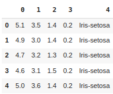
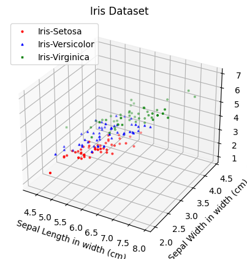
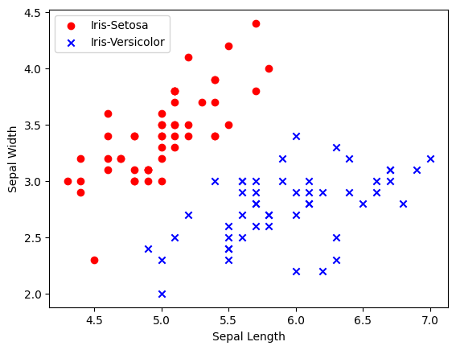
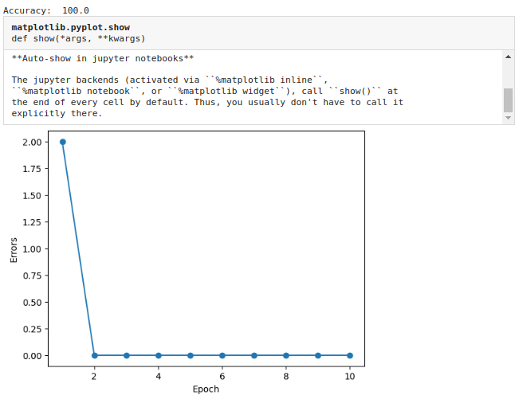

### Name - Sam Israel D
### Register no. - 212222230128
### Date - 13/09/24
# Experiment No. 2 
## Implementation of Perceptron for Binary Classification
## AIM:
To implement a perceptron for classification using Python<BR>

## EQUIPMENTS REQUIRED:
Hardware – PCs
Anaconda – Python 3.7 Installation / Google Colab /Jupiter Notebook

## RELATED THEORETICAL CONCEPT:
A Perceptron is a basic learning algorithm invented in 1959 by Frank Rosenblatt. It is meant to mimic the working logic of a biological neuron. The human brain is basically a collection of many interconnected neurons. Each one receives a set of inputs, applies some sort of computation on them and propagates the result to other neurons.<BR>
A Perceptron is an algorithm used for supervised learning of binary classifiers.Given a sample, the neuron classifies it by assigning a weight to its features. To accomplish this a Perceptron undergoes two phases: training and testing. During training phase weights are initialized to an arbitrary value. Perceptron is then asked to evaluate a sample and compare its decision with the actual class of the sample.If the algorithm chose the wrong class weights are adjusted to better match that particular sample. This process is repeated over and over to finely optimize the biases. After that, the algorithm is ready to be tested against a new set of completely unknown samples to evaluate if the trained model is general enough to cope with real-world samples.<BR>
The important Key points to be focused to implement a perceptron:
Models have to be trained with a high number of already classified samples. It is difficult to know a priori this number: a few dozen may be enough in very simple cases while in others thousands or more are needed.
Data is almost never perfect: a preprocessing phase has to take care of missing features, uncorrelated data and, as we are going to see soon, scaling.<BR>
Perceptron requires linearly separable samples to achieve convergence.
The math of Perceptron. <BR>
If we represent samples as vectors of size n, where ‘n’ is the number of its features, a Perceptron can be modeled through the composition of two functions. The first one f(x) maps the input features  ‘x’  vector to a scalar value, shifted by a bias ‘b’
f(x)=w.x+b
 <BR>
A threshold function, usually Heaviside or sign functions, maps the scalar value to a binary output:

 


Indeed if the neuron output is exactly zero it cannot be assumed that the sample belongs to the first sample since it lies on the boundary between the two classes. Nonetheless for the sake of simplicity,ignore this situation.<BR>


## ALGORITHM:
<ul>
<li>STEP 1: Importing the libraries<BR>
<li>STEP 2:Importing the dataset<BR>
<li>STEP 3:Plot the data to verify the linear separable dataset and consider only two classes<BR>
<li>STEP 4:Convert the data set to scale the data to uniform range by using Feature scaling<BR>
<li>STEP 4:Split the dataset for training and testing<BR>
<li>STEP 5:Define the input vector ‘X’ from the training dataset<BR>
<li>STEP 6:Define the desired output vector ‘Y’ scaled to +1 or -1 for two classes C1 and C2<BR>
<li>STEP 7:Assign Initial Weight vector ‘W’ as 0 as the dimension of ‘X’
<li>STEP 8:Assign the learning rate<BR>
<li>STEP 9:For ‘N ‘ iterations ,do the following:<BR>
        v(i) = w(i)*x(i)<BR>
         
        W (i+i)= W(i) + learning_rate*(y(i)-t(i))*x(i)<BR>
<li>STEP 10:Plot the error for each iteration <BR>
<li>STEP 11:Print the accuracy<BR>
</ul>
## PROGRAM:
### Import Necessary Packages

```python
import numpy as np
import pandas as pd
import matplotlib.pyplot as plt
from mpl_toolkits import mplot3d
from sklearn.model_selection import train_test_split
from sklearn.metrics import accuracy_score
```
### Define the Perceptron Class
```python
class Perceptron:
    def __init__(self, learning_rate = 0.1):
        self.learning_rate = learning_rate
        self.b = 0.0
        self.w = None
        self.misclassified_samples = []

    def fit(self, x: np.array, y: np.array, n_iter = 10):
        self._b = 0.0
        self._w = np.zeros(x.shape[1])
        self.misclassified_samples = []
        for _ in range(n_iter):
            errors = 0
            for xi, yi in zip(x, y):
                update = self.learning_rate * (yi - self.predict(xi))
                self._b += update
                self._w += update * xi
                errors += int(update != 0.0)
            self.misclassified_samples.append(errors)

    def f(self, x: np.array) -> float:
        return np.dot(x, self._w) + self._b

    def predict(self, x: np.array) -> int:
        return np.where(self.f(x) >= 0, 1, -1)
```
### Load and Inspect the Iris Dataset
```python
url = 'https://archive.ics.uci.edu/ml/machine-learning-databases/iris/iris.data'
df = pd.read_csv(url, header=None)
df.head()
```
### Visualize the Iris Dataset in 3D
```python
fig = plt.figure()
ax = plt.axes(projection='3d')
ax.set_title('Iris Dataset')
ax.set_xlabel('Sepal Length in width (cm)')
ax.set_ylabel('Sepal Width in width (cm)')
ax.set_zlabel('Petal Length in width (cm)')

ax.scatter(x[:50,0], x[:50,1], x[:50,2], color='red', marker = 'o', s=4, edgecolor = 'red', label='Iris-Setosa')
ax.scatter(x[50:100, 0], x[50:100, 1], x[50:100, 2], color='blue', marker = '^', s=4, edgecolor = 'blue', label='Iris-Versicolor')
ax.scatter(x[100:150, 0], x[100:150, 1], x[100:150, 2], color='green', marker = 'x', s=4, edgecolor = 'green', label='Iris-Virginica')
plt.legend(loc = 'upper left')
plt.show()
```
### Reduce Dimensions for 2D Visualization
```python
x = x[0:100, 0:2]
y = y[0:100]

plt.scatter(x[:50, 0], x[:50, 1], color = 'red', marker = 'o', label = 'Iris-Setosa')
plt.scatter(x[50:100, 0], x[50:100, 1], color = 'blue', marker = 'x', label = 'Iris-Versicolor')

plt.xlabel('Sepal Length')
plt.ylabel('Sepal Width')
plt.legend(loc = 'upper left')
plt.show()
```
### Preprocess Data and Train-Test Split
```python
y = np.where(y == 'Iris-setsa', 1, -1)

x[:, 0] = (x[:, 0] - x[:, 0].mean()) / x[:, 0].std()
x[:, 1] = (x[:, 1] - x[:, 1].mean()) / x[:, 1].std()

x_train, x_test, y_train, y_test = train_test_split(x, y, test_size = 0.25, random_state = 0)
```
### Train the Perceptron and Evaluate Accuracy
```python
classifier = Perceptron(learning_rate = 0.01)
classifier.fit(x_train, y_train)

print("Accuracy: ", accuracy_score(classifier.predict(x_test), y_test)*100)
```
### Plot Misclassified Samples Over Epochs
```python
plt.plot(range(1, len(classifier.misclassified_samples) + 1), classifier.misclassified_samples, marker = 'o')
plt.xlabel('Epoch')
plt.ylabel('Errors')
plt.show()
```

## OUTPUT:

### Dataset

### 3D Representation

### Scatter Plot

### Accuracy & Errors vs Epochs


## RESULT:
 Thus, a single layer perceptron model is implemented using python to classify Iris data set.

 
